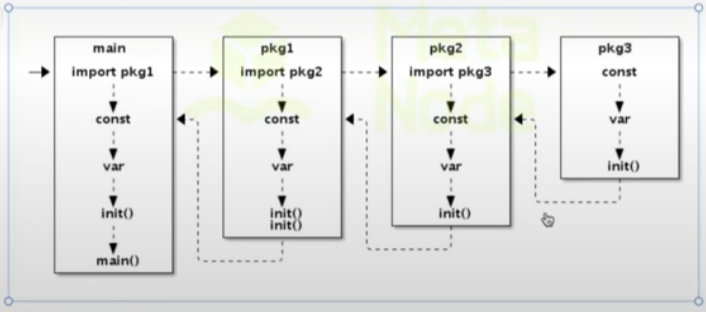

### 1.文件结构

* 1.package声明，声明当前文件所在包，同一目录下只能有一个包

* 2.import导入包：

  ```go
  //单个引入
  import "fmt"
  //多个引入，小括号，且无需逗号分隔
  import ("fmt"
          "time")
  ```

* 其余就是正常的全局变量、函数声明等

### 初始化顺序

完整Go语言可运行程序，主要由go文件结构中的包、变量以及main函数几部分组装成。初始化顺序大概如下：



​	首先加载main函数中的引用包，逐层搜索加载声明的引用包，直到最底层。并按顺序初始化最底层包，按照常量 -> 变量 -> init函数 顺序进行。最终返回main函数执行main()方法。

​	init函数不能人为主动触发，无法被其他包引用，而是go的runtime自动执行的，初始化时自动触发的，并只在包加载时执行一次。 且并不是必须声明的一个函数，但是可以自己声明。

​	同一个包中不同的文件的init执行是按照**文件名（字符串顺序）**依次执行该包内所有源文件中的`init`函数。如果一个文件有多个`init`函数，会按声明顺序执行（但更推荐一个文件一个`init`函数）。

注意事项：

* 不能import名为main的包；
* 若不同包的包名相同（或与当前包名冲突），可在导入时指定别名：

```go
import (
    "myproject/utils"       // 包名是 helper
    myhelper "other/utils"  // 为另一个包名也是 helper 的包指定别名
)

// 使用时：
utils.DoSomething()    // 实际调用的是 myproject/utils 包的 helper.DoSomething()
myhelper.DoSomething() // 调用 other/utils 包的功能
```

* 若只需执行包的 `init()` 函数而不直接使用其成员，可匿名导入（用下划线 `_` 作为别名
* package名和路径名可以不同，import时必须以路径名，但是调用方法时需要使用包名。
  * 例如：
    - 假设包的路径是 `github.com/example/utils`，但包内声明为 `package tool`
    - 导入时必须写 `import "github.com/example/utils"`
    - 使用时需用包名 `tool.函数名()`

